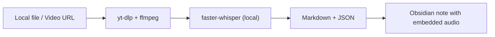

# Echo to Obsidian

[](https://www.python.org/)
[](./LICENSE)
[](https://github.com/SYSTRAN/faster-whisper)

English | [简体中文](./README.zh-CN.md)

Turn videos and audio into Obsidian-ready notes with:

- embedded audio
- timestamped transcript lines
- one-click local workflow

No cloud transcription API required.

## Why people pick this over SaaS tools

1. **Privacy first**  
   Transcription runs locally with `faster-whisper`, so your recordings do not need to be sent to online LLM transcription services.
2. **Cost control**  
   Open-source speech recognition is already strong. If you process content frequently, a local-first workflow can avoid recurring per-minute transcription fees.
3. **Use your own LLM subscription for analysis**  
   After transcription, you can run analysis with your preferred model stack (for example Codex or Claude) using subscriptions you already pay for, instead of buying another closed transcription product bundle.



## Why this project exists

Most transcription workflows are split across three tools:

1. download media
2. transcribe text
3. reformat into Obsidian

Echo to Obsidian keeps these steps in one CLI so you can process content in minutes, not hours.

## What feels different

| Capability | Typical workflow | Echo to Obsidian |
| --- | --- | --- |
| Audio attachment | manual copy | auto-saved to `attachments/` |
| Timestamp links | manual editing | auto-generated per segment |
| Obsidian format | post-processing needed | note is immediately usable |
| Privacy | often cloud-only | local transcription by default |

## Perfect for

- content creators building idea libraries in Obsidian
- researchers collecting Bilibili/YouTube references
- teams who need timestamped meeting or lecture notes

## Features

- local transcription via `faster-whisper`
- supports local files and public video URLs
- auto-save audio attachments under `attachments/`
- each transcript line includes a timestamp link:
  `[[attachments/example.m4a#t=42|00:00:42]]`
- batch mode for folders and markdown link collections

## Install

### Option 1: from source (recommended)

```bash
git clone https://github.com/PuJes/echo-to-obsidian.git
cd echo-to-obsidian
uv sync
```

### Required system tools

- `ffmpeg`
- `yt-dlp` (needed for URL input)

## Quick start

Single item:

```bash
uv run echo2obs "/absolute/path/to/audio.mp3"
```

Public video URL:

```bash
uv run echo2obs "https://www.bilibili.com/video/BVxxxxxxxxx"
```

Batch from markdown:

```bash
uv run echo2obs-batch --from-md "./Cubox" --limit 20 --model-size tiny
```

Batch from media directory:

```bash
uv run echo2obs-batch --from-dir "./recordings" --limit 10
```

## Output structure

By default, outputs are written to `./transcripts`:

```text
transcripts/
  ├── My Note Title.md
  ├── My Note Title.json
  └── attachments/
      └── My Note Title.m4a
```

## Command reference

Single command help:

```bash
uv run echo2obs --help
```

Batch command help:

```bash
uv run echo2obs-batch --help
```

## Notes

- First run may download whisper model weights.
- If your network uses strict proxy rules, try running without proxy for model bootstrap.
- For better quality, use `--model-size small` or `medium`.

## Roadmap

- [ ] one-command retry for failed batch items
- [ ] optional `.srt` and `.vtt` export
- [ ] optional speaker diarization mode

## License

MIT
